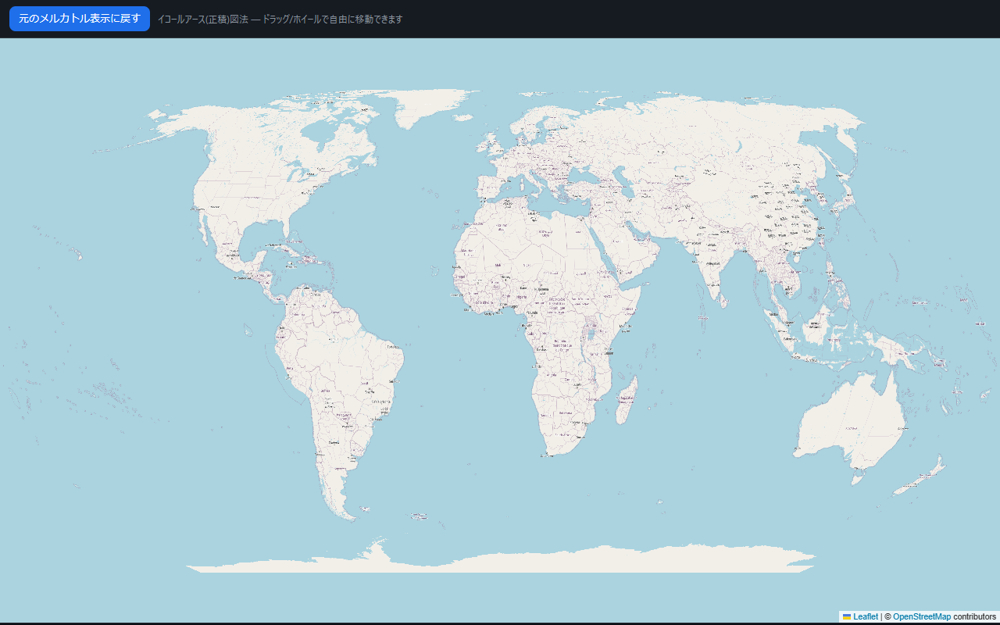

# Equal Earth Maps — 地図をメルカトル図法からイコールアース図法に変える拡張機能

OpenStreetMap / 国土地理院地図の「Webメルカトル」表示を、
**イコールアース (Equal Earth) 正積図法**に変換して表示する Chrome / Firefox 拡張機能です。

> イコールアース図法 = 2018年発表の正積(面積が正しい)図法。メルカトルでは実際より大きく
> 見えるグリーンランド/ロシア/カナダが縮み、アフリカ・南米・オセアニアが正しい比率で描かれます。
> 2026年9月には国連総会が「正積図法への切り替えを推奨する決議」を採択しています。



## できること / できないこと

| サイト | 対応方式 | ズーム |
|---|---|---|
| OpenStreetMap | **自己駆動EE地図(スリッピー)** | **ズームインしてもEEのまま**・オンデマンドでタイル取得 |
| 国土地理院地図 | **自己駆動EE地図(スリッピー)** | **ズームインしてもEEのまま**・オンデマンドでタイル取得 |

- **OSM/国土地理院**は、ONにすると自分自身が動く「イコールアース地図」になります。
  ドラッグ/ホイールでそのまま移動・拡大でき、拡大に必要な地図タイルを裏で取得して
  鮮明化します(元のメルカトル地図には一切戻りません)。
- **都市レベル(高ズーム)ではメルカトルとイコールアースの差はほとんど無い**ため、
  効果は「世界全体〜大陸」の表示で最も明確です(投影の性質上当然の挙動)。

## インストール

### Chrome / Edge / Brave
1. `dist/equal-earth-maps-chrome.zip` を解凍(または `dist/chrome/` フォルダをそのまま使う)
2. `chrome://extensions` を開き、右上「デベロッパー モード」をON
3. 「パッケージ化されていない拡張機能を読み込む」→ `chrome` フォルダを選択

### Firefox
1. `dist/equal-earth-maps-firefox.zip` を解凍
2. `about:debugging#/runtime/this-firefox` を開く
3. 「一時的なアドオンを読み込む」→ 解凍した `manifest.json` を選択
   (Firefox は再起動で外れます。永続化するには AMO 署名が必要)

## 使い方

1. 地図サイト(OpenStreetMap / 国土地理院地図)を開く
2. 拡張アイコン → 「イコールアース表示」をON、または地図上のピルを操作
3. ショートカット `Ctrl+Shift+E` でも切替可能
4. **ドラッグ/ホイール中もイコールアース表示のまま**。OSM/地理院はそのまま
   EE地図として移動・拡大できます(必要なタイルを裏で取得して鮮明化)
   - ズーム範囲: 世界全体の約28%表示(縮小側の下限)〜 道路レベルの詳細(z19相当)まで
5. 地図右上のピルで OFF / 「＋－」ズーム / 「全体へ」世界表示に戻せます

## 動作の仕組み

```
地図ページ (元のメルカトル地図)
   │  [OSM/国土地理院] EESlippy: EE平面上で独自にパン/ズーム。
   │    見えている範囲に必要なメルカトルタイルを同じタイルサーバーから
   │    オンデマンド取得 → モザイク化 (タイルキャッシュで再取得なし)
   ▼
WebGLキャンバス (地図パネルに重ねる。pointer-events:none で操作は素通し)
   │  フラグメントシェーダが「出力ピクセル → Equal Earth逆投影 → (lon,lat)
   │  → ソース(タイルモザイク/画面)をサンプル」
   ▼
イコールアース表示 (ドラッグ/ホイール = EE平面の2D変換で完結)
```

- Equal Earth の正投影/逆投影はシェーダ内に実装(定数 A1..A4 は論文由来)。
  逆投影はニュートン法(24反復・GPU)。
- 未取得領域・図郭外は海色で表示。
- 数学コアは単体テスト済み(ラウンドトリップ誤差 <1e-7度 / 等積性も数値検証)。
- パイプラインは「色=経緯度」のインデックステクスチャによる数値検証済み
  (平均誤差 経度0.36°・緯度0.20° = 色量子化レベルのみ)。

## ファイル構成

```
equal-earth-maps/
├─ manifest.chrome.json / manifest.firefox.json
├─ background.js             ショートカット / 設定の同期
├─ content/content.js        ページ内コントローラ
├─ BUILD.md                  AMOソース提出用のビルド手順
├─ popup/                    拡張ポップアップUI
├─ shared/
│  ├─ math.js                Equal Earth + Webメルカトル数式 (JS)
│  ├─ glsl.js                WebGLシェーダ (EE逆投影をGLSLで実装)
│  ├─ engine.js              EEOverlay (WebGL描画エンジン・生座標ビュー対応)
│  ├─ sites.js               対応サイト(OSM / 国土地理院)
│  ├─ sources.js             タイル取得(crossOrigin img + フォールバック)
│  └─ eeslippy.js            自己駆動EE地図(タイルオンデマンド取得)
├─ demo/                     動作デモ / 数値検証 (ブラウザでそのまま試せる)
├─ tests/                    数学の単体テスト
├─ icons/                    アイコン
├─ store/                    ストア提出用アセット(説明文・スクショ・ソースzip)
└─ dist/                     ビルド成果物 (chrome / firefox / zip)
```

デモの試し方:
```
cd equal-earth-maps && python -m http.server 8099
# ブラウザで http://127.0.0.1:8099/demo/demo.html#ee
```

## 既知の制限

- 対応は OpenStreetMap / 国土地理院地図のみ(他サイトは描画エンジンが非公開のため非対応)。
- メルカトル由来のため緯度表示は ±85.05° が上限。極付近のごく一部は表示されません。
- OSM/国土地理院で高DPI・巨大モニタの場合、描画解像度は自動調整されます。
- OSM/国土地理院のタイルは「ページ自身が取得するのと同じ条件(ブラウザUA・
  ページのReferer)」で控えめに取得します(並行8本・間隔あり・タイルキャッシュ)。
  それでも418等でブロックされた場合はタイルサーバーの使用ポリシー
  (https://operations.osmfoundation.org/policies/tiles/)に従ってください。
  ブロックは時間経過で回復します。
- 地図サイトの仕様変更で表示が崩れることがあります(その場合は sites.js / eeslippy.js を調整)。
- 表示される地図データ自体の権利は各提供元(OpenStreetMap contributors / 国土地理院)に帰属します。
  商用・再配布・サーバーサイドでの利用は各サイトの利用規約を確認してください。

## ライセンス

MIT (ただし OpenStreetMap タイル等、表示される地図データ自体の権利は各提供元に帰属します)

Equal Earth projection © 2018 Bojan Šavrič, Bernhard Jenny, Tom Patterson
(本実装は同図法の数式を利用する独立実装です)
